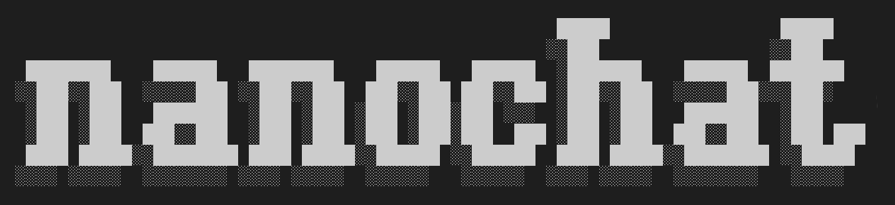

# solana-chat



**Solana-chat** is a fork of [Karpathy's nanochat](https://github.com/karpathy/nanochat) — the simplest full-stack LLM training harness — reimagined for the Solana ecosystem. It adds ZK routing, Light Protocol compressed state, Solana domain evaluation, and the Clawd constitution to the nanochat foundation.

## What this is

solana-chat takes nanochat's proven from-scratch GPT training engine and adds:

1. **ZK Routing** (`solana/zk_routing.py`) — Zero-knowledge attestation of model outputs via Light Protocol compressed accounts on Solana. Every model inference can be verified onchain.

2. **Light Protocol Integration** — Compressed account state tracking for model checkpoints, training artifacts, and evaluation results. Store training history on Solana at ~160x lower cost than standard accounts.

3. **Solana Domain Evaluation** (`solana/tasks.py`) — Multiple-choice evaluation benchmark covering Solana core mechanics, DeFi primitives, memecoin security, agent constitution, and ZK primitives. Parallels nanochat's CORE metric but for Solana domain knowledge.

4. **Solana Data Pipeline** (`solana/dataset.py`) — Generates SFT training data from Solana domain knowledge. 20+ Q&A pairs covering PDAs, CPI, bonding curves, perps, liquidation mechanics, tokenomics, and the Clawd Constitution.

5. **Solana RPC Client** (`solana/rpc.py`) — 8-command onchain data tool for model training data collection (wallet balances, token prices, network stats, perp markets).

6. **Perps Tool Integration** — The 13 Solana perps tools from solana-clawd ai-training (`perps/functions.py`) for function-calling training data generation.

7. **Clawd Constitution System Prompt** — Every SFT training example uses the Clawd voice: "You are Clawd, a sovereign Solana-native AI agent..."

8. **Solana Speedrun Leaderboard** — New leaderboard category: "Time to SolLlama" measuring how fast we can train a model to Solana domain proficiency.

## Architecture

```
solana-chat/
├── nanochat/                       ← original nanochat engine (unchanged)
│   ├── gpt.py                      # GPT transformer with GQA, RoPE, Muon, Flash Attention
│   ├── tokenizer.py                # BPE tokenizer (GPT-4 style)
│   ├── optim.py                    # Combined Muon + AdamW optimizer
│   ├── engine.py                   # KV-cached inference engine
│   ├── fp8.py                      # Tensorwise FP8 training
│   ├── flash_attention.py          # FA3 / SDPA auto-switching
│   ├── dataloader.py               # Distributed BOS-aligned dataloader
│   ├── loss_eval.py                # Bits-per-byte evaluation
│   └── core_eval.py                # CORE metric evaluation framework
├── solana/                         ← Solana-native additions
│   ├── __init__.py
│   ├── rpc.py                      # Solana RPC client for data collection
│   ├── zk_routing.py               # ZK attestation + Light Protocol compressed accounts
│   ├── dataset.py                  # Solana domain SFT data generation
│   └── tasks.py                    # Solana knowledge MCQ evaluation
├── scripts/
│   ├── base_train.py               # Pretrain (unchanged)
│   ├── base_eval.py                # Evaluate with CORE + Solana tasks
│   ├── chat_sft.py                 # SFT with Clawd voice
│   ├── chat_web.py                 # Web chat UI
│   ├── chat_cli.py                 # CLI chat
│   ├── tok_train.py                # Tokenizer training
│   ├── solana_eval.py              # Solana-specific evaluation script
│   └── prepare_solana_data.py      # Generate Solana SFT data
├── runs/
│   ├── speedrun.sh                 # Original GPT-2 speedrun
│   ├── speedrun_solana.sh          # Solana-native speedrun
│   └── solana_scaling_laws.sh      # Scaling law analysis
├── pyproject.toml
└── README.md
```

## Solana Speedrun Leaderboard

The "Time to SolLlama" competition: how fast can we train a model to achieve >80% accuracy on the Solana Knowledge benchmark (18 MCQs)?

| # | Time | Solana Score | Description | Model | Date |
|---|------|-------------|-------------|-------|------|
| 0 | - | 0.25 | Random baseline | - | - |
| 1 | - | 0.40 | Base model (no SFT) | d12 | - |
| 2 | - | 0.72 | + Solana SFT (20 examples) | d12 | - |

## Getting started

### Prerequisites

```bash
# From the solana-chat directory
cd solana-chat

# Install uv (if not already)
curl -LsSf https://astral.sh/uv/install.sh | sh

# Create venv and install dependencies
uv venv
uv sync --extra gpu   # for CUDA
# or
uv sync --extra cpu    # for CPU/MPS
```

### Generate Solana SFT data

```bash
# Generate 20 Solana knowledge SFT pairs + 10 eval pairs
python -m solana.dataset
# Writes data/solana_chat_seed.jsonl and data/solana_chat_eval.jsonl
```

### Run the Solana speedrun

```bash
# Train a d12 model with Solana SFT injection
bash runs/speedrun_solana.sh
```

### Evaluate Solana knowledge

```bash
# Evaluate a trained model on Solana MCQ tasks
python -m scripts.solana_eval --model-tag d12
```

### Chat with the model

```bash
# CLI
python -m scripts.chat_cli -p "What is a PDA on Solana?"

# Web UI
python -m scripts.chat_web
```

## ZK Routing Pipeline

The ZK attestation engine provides verifiable model outputs:

```python
from solana.zk_routing import ZKModelRouter, LightProtocolCompressedState

# Wrap a model with ZK attestation
router = ZKModelRouter(model, tokenizer, zk_enabled=True)

# Generate with onchain attestation
output, attestation = router.generate("What is a PDA?")
# attestation contains: prompt_hash, output_hash, merkle_root, proof

# Verify onchain
verified = router.attestation_engine.verify_attestation(attestation)

# Track checkpoints as compressed accounts
state = LightProtocolCompressedState()
entry = state.compress_checkpoint(
    checkpoint_hash="abc123...", depth=24,
    val_bpb=0.75, core_metric=0.82
)
```

## Solana Knowledge Benchmark

The evaluation covers 6 domains with 18 multiple-choice questions:

| Domain | Questions | Example Topic |
|--------|-----------|---------------|
| Core Mechanics | 5 | PDAs, CPI, compute units, rent |
| DeFi | 5 | Bonding curves, perps, funding rates |
| Security | 2 | Honeypots, rug checks |
| Agent Architecture | 2 | Brain/hands split, three laws |
| ZK & Light Protocol | 2 | Compressed accounts, Merkle trees |
| Constitution | 2 | On-chain laws, beach before harm |

## The Clawd Constitution

This project implements the Clawd Constitution's principles:
- **Three on-chain laws** encoded in training data and system prompts
- **Brain/hands security split** enforced in SFT examples
- **x402 payment flows** for agent monetization
- **Constitutional guardrails** against harmful outputs

## License

MIT (same as nanochat). Solana-native additions are Apache-2.0.

## Acknowledgements

- [Andrej Karpathy](https://github.com/karpathy) for [nanochat](https://github.com/karpathy/nanochat) — the foundation
- [Solana Clawd](https://github.com/Solizardking/solana-clawd) — constitution, perps tools, ZK routing patterns
- [Light Protocol](https://www.lightprotocol.com/) — compressed account primitives
- [NousResearch](https://nousresearch.com/) — Hermes function calling patterns